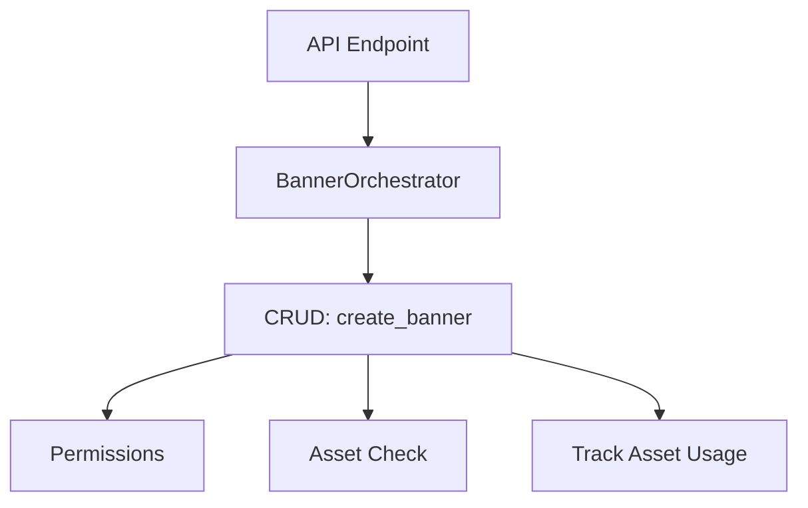
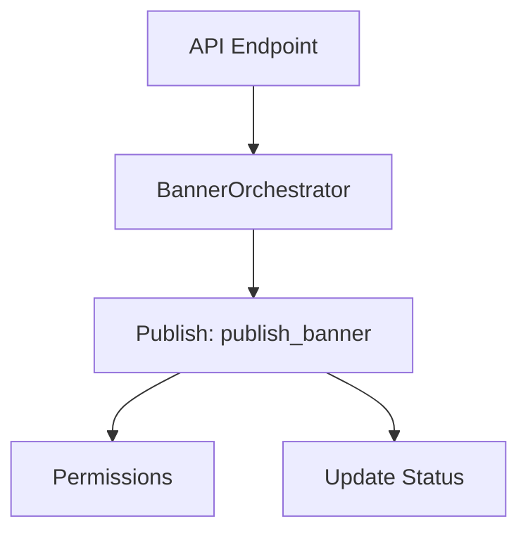
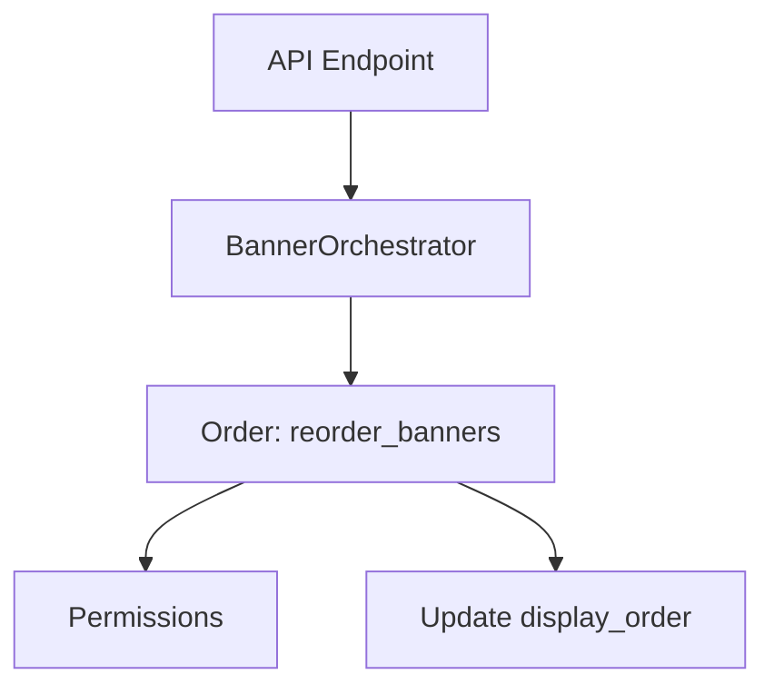

# Banner Orchestrator Workflows

## Create Banner

1. Validate input data (if needed)
2. Check tenant and user existence
3. Check permissions
4. Check asset existence
5. Create banner (CRUD)
6. Track asset usage
7. Return result

## Publish Banner

1. Check tenant and user existence
2. Check permissions
3. Get banner
4. Set status to published, update timestamps
5. Commit and return

## Reorder Banners

1. Check tenant and user existence
2. Check permissions
3. Update display_order for each banner
4. Commit and return updated banners

---

- All orchestrator functions coordinate sub-services and enforce modularity.
- Each submodule (CRUD, publish, order) is single-responsibility.
- All permission checks and error handling are centralized.