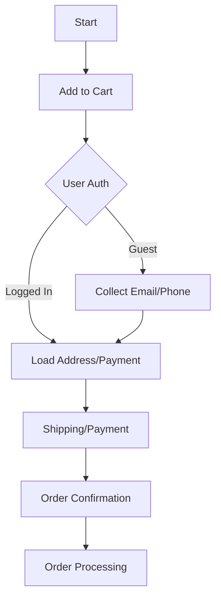
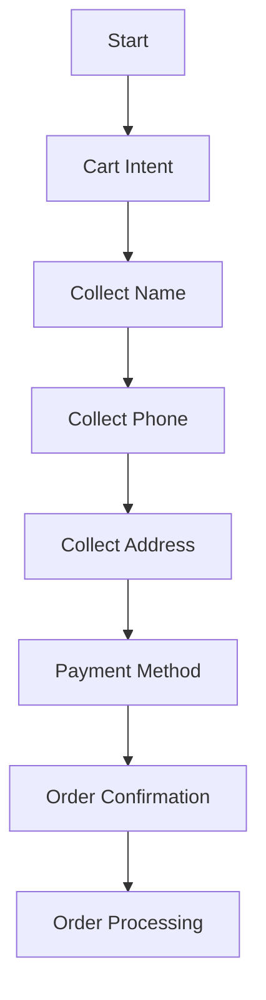
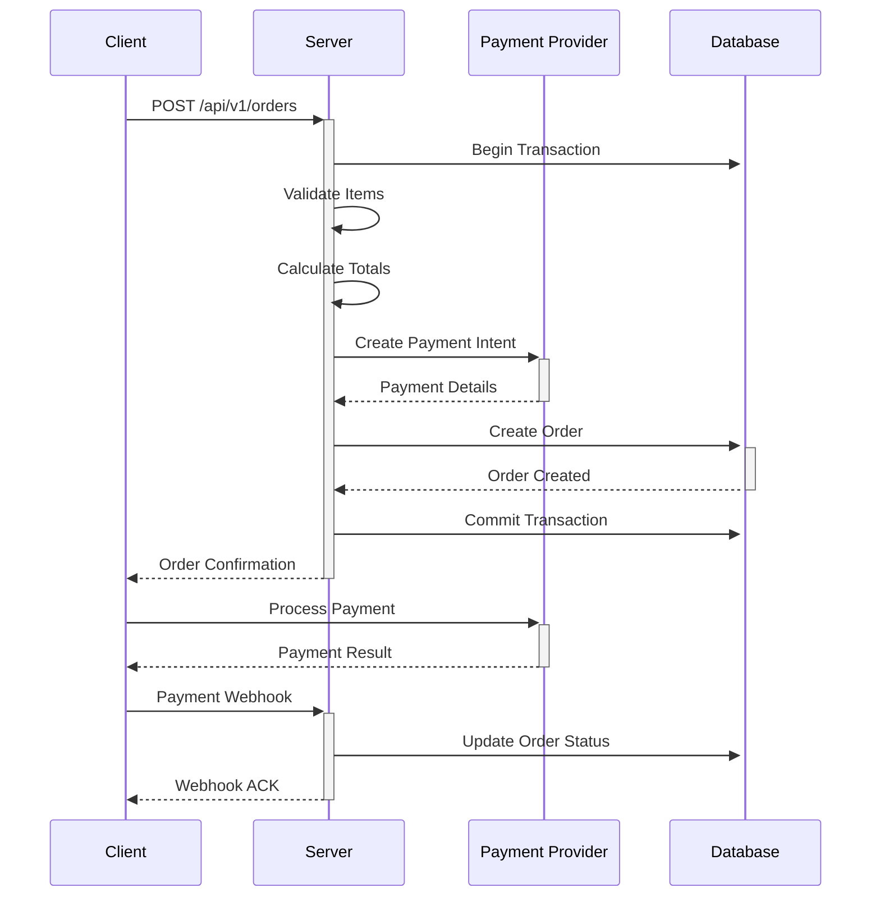

# Unified Checkout Flow

## Overview

This document outlines the unified checkout flow that handles both web and chat-based purchases, ensuring a consistent experience across all channels.

## Flowcharts

### Web Checkout Flow



### Chat Checkout Flow



## Sequence Diagram: Order Creation



## API Payloads

### Web Checkout Request

```json
{
  "items": [
    {
      "product_id": "uuid",
      "quantity": 1,
      "variant_id": "uuid"
    }
  ],
  "shipping_address": {
    "name": "John Doe",
    "line1": "123 Main St",
    "city": "Nairobi",
    "country": "KE"
  },
  "payment_method": {
    "type": "card|mobile_money",
    "token": "pm_..."
  }
}
```

### Chat Checkout Request

```json
{
  "channel": "whatsapp",
  "phone_number": "+254700123456",
  "session_id": "session_123",
  "items": [
    {
      "product_id": "uuid",
      "quantity": 1
    }
  ]
}
```

## State Management

### Order Status Flow

1. `draft` → Initial state
2. `pending_payment` → Order created, awaiting payment
3. `processing` → Payment received, order being processed
4. `shipped` → Order shipped to customer
5. `delivered` → Order delivered
6. `cancelled` → Order cancelled

### Error States

- `payment_failed` → Payment declined
- `payment_requires_action` → 3DS/OTP required
- `on_hold` → Manual review needed

## Webhook Events

### Payment Success

```json
{
  "event": "payment.succeeded",
  "data": {
    "order_id": "order_123",
    "amount": 1000,
    "currency": "KES"
  }
}
```

### Payment Failed

```json
{
  "event": "payment.failed",
  "data": {
    "order_id": "order_123",
    "reason": "insufficient_funds",
    "code": "card_declined"
  }
}
```

## Implementation Notes

### Idempotency

- All POST endpoints support idempotency keys
- Include `Idempotency-Key` header for retries
- 24-hour idempotency window

### Rate Limiting

- 100 requests/minute per IP
- 5 concurrent checkouts per user
- 3 attempts for failed payments

### Security

- All card data handled by payment processor
- PCI DSS compliant
- TLS 1.2+ required

## Testing

### Test Cards

- Success: `4242 4242 4242 4242`
- 3D Secure: `4000 0025 0000 3155`
- Insufficient Funds: `4000 0000 0000 9995`

### Webhook Testing

Use Stripe CLI for local testing:

```bash
stripe listen --forward-to localhost:8000/api/webhooks/stripe
```

## Mobile SDK Integration

### Android

```kotlin
val checkoutSession = CheckoutSession.create(
    context = this,
    publishableKey = "pk_test_...",
    sessionId = "cs_test_..."
)
```

### iOS

```swift
let config = STPPaymentConfiguration()
config.publishableKey = "pk_test_..."
let paymentContext = STPPaymentContext(apiAdapter: self, configuration: config)
```

## Troubleshooting

### Common Issues

1. **Payment Declined**

   - Check card details
   - Verify 3D Secure completion
   - Contact bank for restrictions

2. **Webhook Failures**

   - Verify endpoint URL
   - Check signature verification
   - Review server logs

3. **Order Stuck Processing**
   - Check payment provider dashboard
   - Verify webhook delivery
   - Manual intervention may be required

## Support

For issues not covered here, contact support@example.com with:

- Order ID
- Timestamp
- Screenshots (if applicable)
- Steps to reproduce
