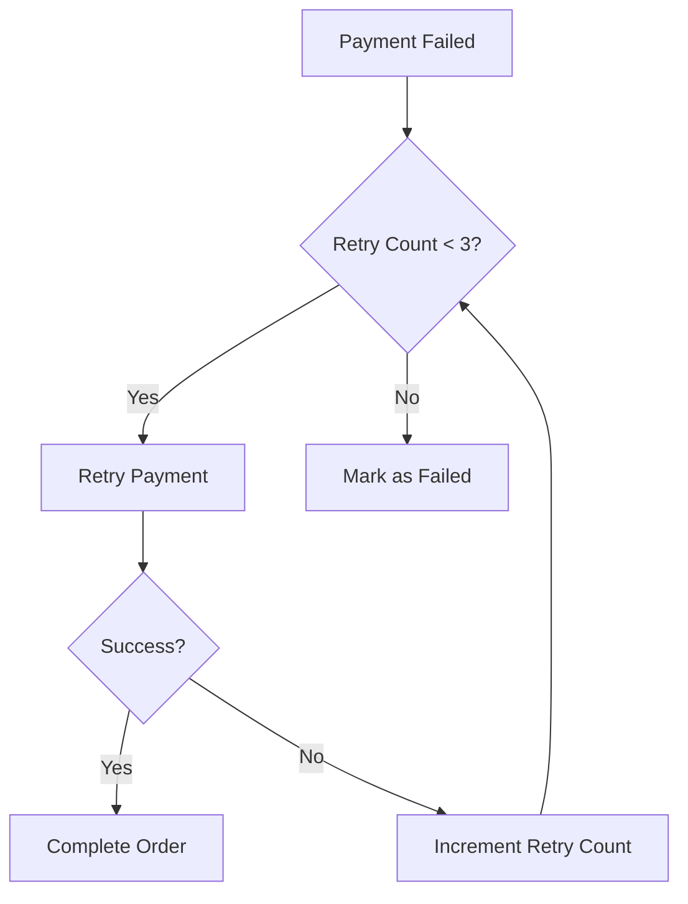

# Error Handling & Recovery

## Overview

This document outlines the error handling strategy for both web and chat interfaces, including user-facing messages and logging mechanisms.

## User-Facing Error Messages

### Web Interface Errors

#### Payment Failures

```json
{
  "error": {
    "code": "payment_failed",
    "message": "Your payment could not be processed. Please try again or use a different payment method.",
    "details": {
      "reason": "insufficient_funds",
      "suggestion": "Please ensure your account has sufficient balance or try a different card."
    },
    "retryable": true
  }
}
```

#### Validation Errors

```json
{
  "error": {
    "code": "validation_error",
    "message": "Please correct the following errors:",
    "details": [
      {
        "field": "email",
        "error": "Must be a valid email address"
      },
      {
        "field": "phone",
        "error": "Must be a valid phone number"
      }
    ]
  }
}
```

### Chat Interface Errors

#### Payment Failure

```
❌ Payment failed: Insufficient funds
💡 Please try again or use a different payment method.

1. Try again
2. Change payment method
3. Contact support
```

#### Out of Stock

```
⚠️ Sorry, that item is out of stock.

Similar items available:
1. [Product Name] - $XX.XX
2. [Product Name] - $XX.XX

Or we can notify you when it's back in stock!
```

## Logging Strategy

### Structured Log Format

```json
{
  "timestamp": "2025-06-15T20:00:00Z",
  "level": "ERROR",
  "service": "payment-service",
  "request_id": "req_abc123",
  "session_id": "sess_xyz789",
  "user_id": "user_123",
  "error": {
    "type": "PaymentError",
    "code": "card_declined",
    "message": "Insufficient funds",
    "stack_trace": "...",
    "context": {
      "amount": 1000,
      "currency": "KES",
      "payment_method": "card_xyz"
    }
  },
  "tags": ["payment", "checkout"],
  "environment": "production"
}
```

### Log Levels

- **ERROR**: Critical failures that need immediate attention
- **WARN**: Non-critical issues that should be reviewed
- **INFO**: Important business events
- **DEBUG**: Detailed debugging information
- **TRACE**: Very detailed debugging information

### Log Retention

- 7 days for DEBUG/TRACE logs
- 30 days for INFO logs
- 1 year for WARN/ERROR logs

## Error Recovery Flows

### Payment Retry Logic



### Fallback Payment Methods

1. Primary payment method (credit card)
2. Secondary payment method (if available)
3. Mobile money (M-Pesa)
4. Cash on delivery (if enabled)

## Monitoring & Alerts

### Error Budgets

| Error Type       | Budget | Time Window | Action                   |
| ---------------- | ------ | ----------- | ------------------------ |
| Payment Failures | 5%     | 1h          | Page on-call engineer    |
| 5xx Errors       | 1%     | 5m          | Create ticket            |
| 4xx Errors       | 10%    | 1h          | Review next business day |

### Alert Channels

- **P0 (Critical)**: PagerDuty → Phone Call
- **P1 (High)**: PagerDuty → SMS
- **P2 (Medium)**: Email + Slack
- **P3 (Low)**: Dashboard only

## Common Error Codes

### HTTP Status Codes

- `400 Bad Request`: Invalid request data
- `401 Unauthorized`: Authentication required
- `403 Forbidden`: Insufficient permissions
- `404 Not Found`: Resource not found
- `409 Conflict`: Resource conflict
- `422 Unprocessable Entity`: Validation error
- `429 Too Many Requests`: Rate limit exceeded
- `500 Internal Server Error`: Server error
- `502 Bad Gateway`: Upstream service error
- `503 Service Unavailable`: Service maintenance
- `504 Gateway Timeout`: Upstream timeout

### Business Error Codes

| Code                | HTTP Status | Description                     |
| ------------------- | ----------- | ------------------------------- |
| invalid_payment     | 400         | Payment details invalid         |
| insufficient_funds  | 402         | Insufficient funds              |
| item_unavailable    | 409         | Item out of stock               |
| rate_limited        | 429         | Too many requests               |
| service_unavailable | 503         | Service temporarily unavailable |

## Incident Response

### Triage Process

1. **Identify**: Determine error type and impact
2. **Contain**: Stop the bleeding (e.g., disable feature)
3. **Diagnose**: Find root cause
4. **Resolve**: Implement fix
5. **Verify**: Confirm resolution
6. **Document**: Post-mortem and follow-up

### Post-Mortem Template

```markdown
# Incident Report: [Title]

## Summary

[Brief description of the incident]

## Impact

- Duration: [Start time] to [End time]
- Affected services: [List services]
- Users affected: [Number/percentage]

## Timeline

- **HH:MM**: First detection
- **HH:MM**: Team notified
- **HH:MM**: Mitigation started
- **HH:MM**: Service restored

## Root Cause

[Detailed technical explanation]

## Action Items

- [ ] Item 1
- [ ] Item 2
- [ ] Item 3

## Prevention

[Steps to prevent recurrence]
```

## Testing Error Conditions

### Unit Tests

```python
def test_insufficient_funds():
    with pytest.raises(PaymentError) as excinfo:
        process_payment(amount=1000, card="4000 0000 0000 9995")
    assert excinfo.value.code == "insufficient_funds"
```

### Integration Tests

```python
def test_payment_retry_logic():
    # First attempt fails
    with patch('stripe.PaymentIntent.create', side_effect=CardError("Insufficient funds", "", "")):
        response = test_client.post("/checkout", json=test_order)
        assert response.status_code == 402

    # Second attempt succeeds
    response = test_client.post("/checkout", json=test_order)
    assert response.status_code == 200
```

### Chaos Engineering

1. **Network Partitions**: Simulate network failures between services
2. **Latency Injection**: Add artificial delay to API responses
3. **Dependency Failure**: Take down dependent services
4. **Load Testing**: Simulate traffic spikes

## Client-Side Error Tracking

### Web

```javascript
// Initialize error tracking
Sentry.init({
  dsn: 'YOUR_DSN',
  release: 'myapp@1.0.0',
  environment: 'production',
  // Track user interactions
  beforeSend(event) {
    // Add custom context
    event.user = { id: getUserId() };
    return event;
  },
});

// Report handled errors
Sentry.captureException(new Error('Something went wrong'));

// Track performance
const transaction = Sentry.startTransaction({ name: 'checkout' });
// ... your code ...
transaction.finish();
```

### Mobile (Android)

```kotlin
// Initialize
SentryAndroid.init(context) { options ->
    options.dsn = "YOUR_DSN"
    options.tracesSampleRate = 0.2
}

// Report error
try {
    // Your code
} catch (e: Exception) {
    Sentry.captureException(e)
}
```

## Monitoring Dashboards

### Required Dashboards

1. **Error Rates**

   - Error rate by endpoint
   - Error rate by error code
   - Error rate by service

2. **Performance**

   - API response times (p50, p90, p99)
   - Database query performance
   - External service latency

3. **Business Metrics**
   - Checkout conversion rate
   - Payment success rate
   - Cart abandonment rate

## Alert Thresholds

### Critical (P0)

- Payment success rate < 95%
- API error rate > 5%
- 5xx errors > 1%

### Warning (P1)

- API latency > 1s (p95)
- 4xx errors > 10%
- Queue depth > 1000

## Runbooks

### Payment Failure

1. Check payment provider status page
2. Verify API keys and credentials
3. Review recent deployments
4. Check database connectivity
5. Verify sufficient funds/limits

### High Error Rate

1. Identify affected endpoints
2. Check for recent deployments
3. Review error logs
4. Check dependent services
5. Verify infrastructure health

## Continuous Improvement

### Weekly Error Review

1. Top errors by occurrence
2. New or increasing errors
3. False positives in alerts
4. Documentation updates needed

### Monthly Metrics

- MTTR (Mean Time To Resolve)
- Error rate trends
- Alert volume and accuracy
- False positive rate

## Support Contacts

- **Engineering**: eng-support@example.com
- **Payment Issues**: payments@example.com
- **24/7 On-Call**: +1-555-123-4567

## Appendix

### Common Error Messages

| Code | Message          | Resolution                |
| ---- | ---------------- | ------------------------- |
| 1001 | Invalid API key  | Verify API key is correct |
| 1002 | Expired token    | Refresh authentication    |
| 2001 | Item not found   | Verify item ID            |
| 3001 | Payment declined | Contact bank              |

### Rate Limits

- API: 100 requests/minute per IP
- Checkout: 5 requests/minute per user
- Payment methods: 3 attempts per 10 minutes
