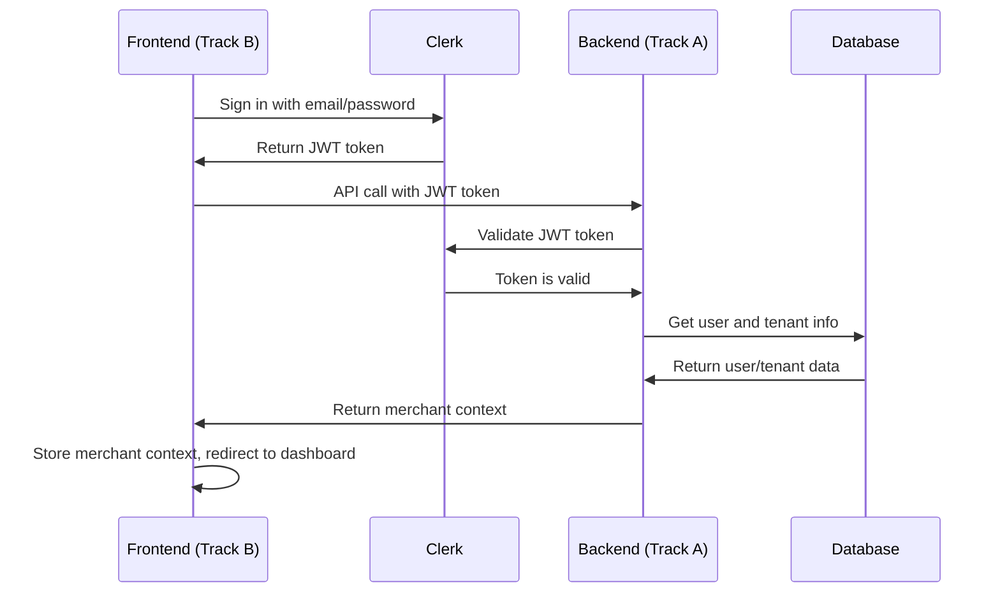
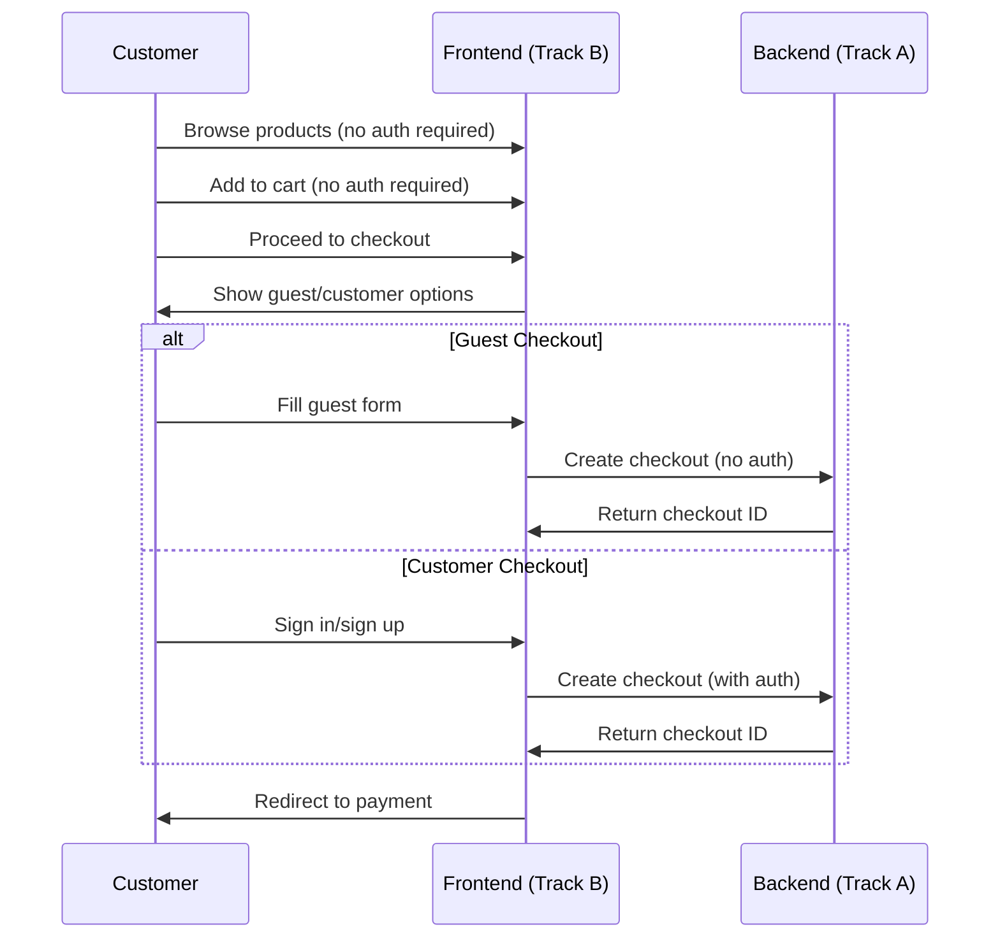

# Authentication Flow Coordination for Track A & B

## 🎯 Overview

This document defines the authentication patterns that Track A (backend) implements and Track B (frontend) must integrate with. The system supports both merchant admin authentication and optional customer authentication.

---

## 🔐 Authentication Architecture

### **Multi-Context Authentication**

```
enwhe.io Authentication System
├── Merchant Admin (admin.enwhe.io/store/{merchant-id}/)
│   ├── Required for all operations
│   ├── JWT-based with tenant validation
│   └── Clerk integration for user management
├── Customer Storefront ({merchant-id}.enwhe.io)
│   ├── Optional for browsing
│   ├── Required for checkout
│   └── Guest checkout supported
└── Global Admin (admin.enwhe.com)
    ├── Super admin access
    ├── Multi-tenant management
    └── System-wide operations
```

---

## 🏪 Merchant Admin Authentication

### **Track A Implementation (Backend)**

#### **1. Authentication Middleware**
```python
# backend/app/core/security/auth_deps.py
async def require_merchant_auth(
    current_user: ClerkTokenData = Depends(require_auth),
    db: AsyncSession = Depends(get_db)
) -> MerchantContext:
    """
    Validate merchant authentication and tenant access.

    Ensures:
    1. User is authenticated via Clerk
    2. User has access to the specific merchant
    3. Tenant is active and valid
    """
    # Get user from database
    user = await get_user_by_clerk_id(db, current_user.sub)

    if not user or not user.tenant_id:
        raise HTTPException(
            status_code=status.HTTP_403_FORBIDDEN,
            detail="User not associated with any merchant"
        )

    # Get tenant and validate access
    tenant = await get_tenant_by_id(db, user.tenant_id)

    if not tenant or not tenant.is_active:
        raise HTTPException(
            status_code=status.HTTP_403_FORBIDDEN,
            detail="Merchant account is not active"
        )

    return MerchantContext(
        user=user,
        tenant=tenant,
        merchant_id=str(tenant.id)
    )
```

#### **2. API Endpoint Protection**
```python
# Example admin endpoint with authentication
@router.get("/admin/{merchant_id}/dashboard/metrics")
async def get_dashboard_metrics(
    merchant_context: MerchantContext = Depends(require_merchant_auth),
    db: AsyncSession = Depends(get_db)
):
    """
    Get dashboard metrics for the authenticated merchant.

    Requires:
    - Valid JWT token from Clerk
    - User associated with the merchant
    - Active merchant account
    """
    # merchant_context.tenant contains the validated tenant
    # All data is automatically scoped to this tenant
    return await get_merchant_metrics(db, merchant_context.tenant.id)
```

#### **3. JWT Token Validation**
```python
# backend/app/core/security/clerk_multi_org.py
class MultiOrgClerkTokenData:
    """
    Validates Clerk JWT tokens and extracts user/tenant information.
    """

    def __init__(self, token: str):
        # Validate JWT signature with Clerk public key
        # Extract user ID, organization info, and metadata
        # Handle both seller and admin organizations
        pass

    @property
    def user_id(self) -> str:
        """Get the Clerk user ID."""
        return self.sub

    @property
    def merchant_id(self) -> Optional[str]:
        """Get the merchant ID from token metadata."""
        return self.metadata.get("merchant_id") if self.metadata else None

    @property
    def is_admin(self) -> bool:
        """Check if user has admin role."""
        return "admin" in self.roles
```

### **Track B Implementation (Frontend)**

#### **1. Authentication Context**
```typescript
// frontend/src/contexts/AuthContext.tsx
interface AuthContextType {
  // Merchant admin authentication
  merchantUser: MerchantUser | null;
  merchantTenant: Tenant | null;
  isMerchantAuthenticated: boolean;

  // Customer authentication (optional)
  customerUser: CustomerUser | null;
  isCustomerAuthenticated: boolean;

  // Authentication methods
  signInAsMerchant: (email: string, password: string) => Promise<void>;
  signOutAsMerchant: () => Promise<void>;
  signInAsCustomer: (email: string, password: string) => Promise<void>;
  signOutAsCustomer: () => Promise<void>;

  // Loading states
  isLoading: boolean;
}

const AuthContext = createContext<AuthContextType | undefined>(undefined);
```

#### **2. Protected Admin Routes**
```typescript
// frontend/src/components/ProtectedAdminRoute.tsx
interface ProtectedAdminRouteProps {
  children: React.ReactNode;
  merchantId: string;
}

const ProtectedAdminRoute: React.FC<ProtectedAdminRouteProps> = ({
  children,
  merchantId
}) => {
  const { isMerchantAuthenticated, merchantTenant } = useAuth();
  const router = useRouter();

  useEffect(() => {
    if (!isMerchantAuthenticated) {
      router.push('/auth/sign-in');
      return;
    }

    // Validate merchant access
    if (merchantTenant?.id !== merchantId) {
      router.push('/auth/unauthorized');
      return;
    }
  }, [isMerchantAuthenticated, merchantTenant, merchantId, router]);

  if (!isMerchantAuthenticated || merchantTenant?.id !== merchantId) {
    return <LoadingSpinner />;
  }

  return <>{children}</>;
};
```

#### **3. API Client with Authentication**
```typescript
// frontend/src/lib/api/adminClient.ts
class AdminApiClient {
  private baseURL: string;
  private token: string | null;

  constructor(merchantId: string) {
    this.baseURL = `https://api.enwhe.io/api/v1/admin/${merchantId}`;
    this.token = getAuthToken();
  }

  private getHeaders(): HeadersInit {
    return {
      'Authorization': `Bearer ${this.token}`,
      'X-Tenant-ID': merchantId,
      'Content-Type': 'application/json'
    };
  }

  async getDashboardMetrics() {
    const response = await fetch(`${this.baseURL}/dashboard/metrics`, {
      headers: this.getHeaders()
    });

    if (!response.ok) {
      if (response.status === 401) {
        // Redirect to login
        window.location.href = '/auth/sign-in';
        return;
      }
      throw new Error('Failed to fetch dashboard metrics');
    }

    return response.json();
  }
}
```

---

## 🛍️ Customer Storefront Authentication

### **Track A Implementation (Backend)**

#### **1. Optional Authentication**
```python
# backend/app/api/v1/storefront/endpoints/products.py
@router.get("/storefront/{merchant_id}/products")
async def list_storefront_products(
    merchant_id: str,
    subdomain: str = Query(...),
    # No authentication required for browsing
    db: AsyncSession = Depends(get_db)
):
    """
    List products for customer browsing.

    No authentication required - customers can browse freely.
    """
    tenant = await get_tenant_by_subdomain(db, subdomain)
    if not tenant:
        raise HTTPException(status_code=404, detail="Store not found")

    return await get_products_for_storefront(db, tenant.id)
```

#### **2. Checkout Authentication**
```python
# backend/app/api/v1/storefront/endpoints/checkout.py
@router.post("/storefront/{merchant_id}/checkout")
async def create_checkout(
    merchant_id: str,
    checkout_data: CheckoutCreate,
    # Optional authentication for checkout
    current_customer: Optional[CustomerUser] = Depends(get_optional_customer_auth),
    db: AsyncSession = Depends(get_db)
):
    """
    Create checkout for customer purchase.

    Authentication is optional - supports guest checkout.
    """
    tenant = await get_tenant_by_id(db, merchant_id)

    # Create checkout with or without customer
    checkout = await create_checkout_order(
        db=db,
        tenant_id=tenant.id,
        checkout_data=checkout_data,
        customer_id=current_customer.id if current_customer else None
    )

    return checkout
```

### **Track B Implementation (Frontend)**

#### **1. Guest Checkout Support**
```typescript
// frontend/src/components/CheckoutForm.tsx
interface CheckoutFormProps {
  cart: Cart;
  merchantId: string;
}

const CheckoutForm: React.FC<CheckoutFormProps> = ({ cart, merchantId }) => {
  const { isCustomerAuthenticated, customerUser } = useAuth();
  const [isGuestCheckout, setIsGuestCheckout] = useState(!isCustomerAuthenticated);

  const handleCheckout = async (formData: CheckoutFormData) => {
    try {
      const checkoutData = {
        ...formData,
        items: cart.items,
        customer_id: isCustomerAuthenticated ? customerUser?.id : null
      };

      const response = await fetch(`/api/v1/storefront/${merchantId}/checkout`, {
        method: 'POST',
        headers: {
          'Content-Type': 'application/json',
          ...(isCustomerAuthenticated && {
            'Authorization': `Bearer ${getCustomerToken()}`
          })
        },
        body: JSON.stringify(checkoutData)
      });

      if (response.ok) {
        // Redirect to payment or confirmation
        router.push('/checkout/confirmation');
      }
    } catch (error) {
      console.error('Checkout failed:', error);
    }
  };

  return (
    <form onSubmit={handleCheckout}>
      {/* Guest checkout form */}
      {isGuestCheckout && (
        <GuestCheckoutFields />
      )}

      {/* Customer checkout form */}
      {!isGuestCheckout && isCustomerAuthenticated && (
        <CustomerCheckoutFields customer={customerUser} />
      )}

      <button type="submit">
        {isGuestCheckout ? 'Guest Checkout' : 'Customer Checkout'}
      </button>
    </form>
  );
};
```

---

## 🔄 Authentication Flow Coordination

### **1. Merchant Sign-In Flow**



### **2. Customer Checkout Flow**



### **3. Multi-Tenant Access Control**

```typescript
// Track B: Frontend tenant validation
const validateMerchantAccess = (merchantId: string, userTenantId: string) => {
  if (merchantId !== userTenantId) {
    // User trying to access different merchant
    throw new Error('Unauthorized access to merchant');
  }
};

// Track A: Backend tenant validation
async def validate_merchant_access(user_id: str, merchant_id: str) -> bool:
    user = await get_user_by_id(user_id)
    return user.tenant_id == merchant_id
```

---

## 🧪 Testing Requirements

### **Track A Must Test:**
1. **JWT Validation**: Proper Clerk token validation
2. **Tenant Isolation**: Users can't access other merchants' data
3. **Authentication Scopes**: Admin vs customer permissions
4. **Token Refresh**: Automatic token renewal
5. **Error Handling**: Proper auth error responses

### **Track B Must Test:**
1. **Login Flows**: Merchant and customer authentication
2. **Protected Routes**: Proper access control
3. **Token Management**: Storage and refresh
4. **Error Handling**: Auth error UI
5. **Guest Checkout**: No-auth purchase flow

### **Integration Tests:**
1. **Complete Auth Flow**: Signup → Login → Dashboard Access
2. **Multi-Tenant Security**: Users can't access wrong merchant
3. **Session Persistence**: Auth survives page refresh
4. **Logout Flow**: Proper session cleanup

---

## 📝 Implementation Checklist

### **Track A Checklist:**
- [ ] Implement JWT validation middleware
- [ ] Create merchant context validation
- [ ] Add tenant isolation checks
- [ ] Implement optional customer auth
- [ ] Add proper error responses
- [ ] Test all auth scenarios

### **Track B Checklist:**
- [ ] Create authentication context
- [ ] Implement protected route components
- [ ] Add login/logout flows
- [ ] Handle guest checkout
- [ ] Add auth error handling
- [ ] Test all auth flows

### **Integration Checklist:**
- [ ] JWT tokens work across domains
- [ ] Tenant isolation enforced
- [ ] Auth errors handled gracefully
- [ ] Performance meets requirements
- [ ] Security requirements satisfied

---

**Last Updated**: [Current Date]
**Version**: 1.0
**Next Review**: [Date]