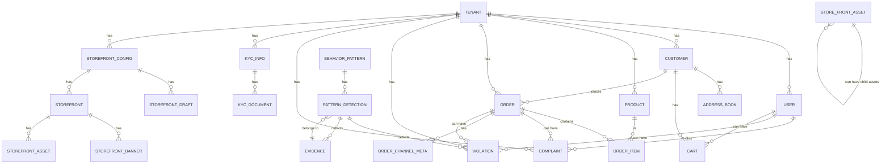

# Database Schema & Design

## Overview

ConversationalCommerce uses a modular, multi-tenant PostgreSQL schema with strict tenant isolation (RLS), event-driven patterns, and support for conversational commerce. All IDs are UUIDs. Key entities include tenants, users, customers, products, orders, carts, storefronts, and event/violation tracking.

## Entity-Relationship Diagram

## Key Entities

- **Tenant**: Top-level entity for multi-tenancy. Owns users, products, orders, storefronts, and all data. Enforces isolation via PostgreSQL RLS.
- **User**: Platform user (seller, admin, etc.), linked to a tenant. Can file complaints, have violations, and own carts.
- **Customer**: End-buyer, can have address book, carts, and place orders.
- **Product**: Belongs to a tenant. Can be referenced in orders and order items.
- **Order**: Placed by a customer, references products, has items, channel metadata, and can have complaints/violations.
- **Cart**: Temporary shopping cart, linked to user/customer/tenant.
- **StorefrontConfig/Storefront**: Tenant's public-facing store, with drafts, banners, assets, and theming.
- **KYCInfo/KYCDocument**: KYC verification for tenants, with document uploads and status.
- **Violation/Complaint**: Tracks policy violations and customer complaints, linked to users, orders, tenants.
- **PatternDetection/BehaviorPattern/Evidence**: For behavior analysis, fraud detection, and evidence tracking.

## Design Rationale

- **Multi-Tenancy**: All core tables have a `tenant_id` and are protected by PostgreSQL Row-Level Security (RLS) for strict data isolation.
- **UUID Everywhere**: All primary and foreign keys use UUID for global uniqueness and easier sharding if needed.
- **Event-Driven**: Orders, payments, and conversation events are tracked for analytics, monitoring, and automation.
- **Extensible Storefronts**: Storefronts are modular, with drafts, banners, assets, and custom theming per tenant.
- **KYC & Compliance**: Built-in KYC flows for onboarding, with document management and status tracking.
- **Content & Behavior Moderation**: Violation and pattern detection tables support AI-driven content moderation and fraud detection.

## Migration & Versioning Policy

- **Alembic** is used for all schema migrations. See `/backend/alembic/` and [Architecture](/docs/ARCHITECTURE.md) for workflow.
- **Versioning**: All models have `created_at`/`updated_at` timestamps. Orders use a `version` field for optimistic locking.
- **Best Practices**:
  - Always add new tables/columns with defaults and backfill scripts if needed.
  - Use Alembic's autogenerate, but review diffs for accuracy.
  - Test migrations in staging before production.
  - Document all breaking changes in [Breaking Changes & Migration Guide](/docs/ARCHITECTURE.md#breaking-changes--migration-guide).

---

*For more details, see [ARCHITECTURE.md](/docs/ARCHITECTURE.md) and the SQLAlchemy models in `/backend/app/models/`.*