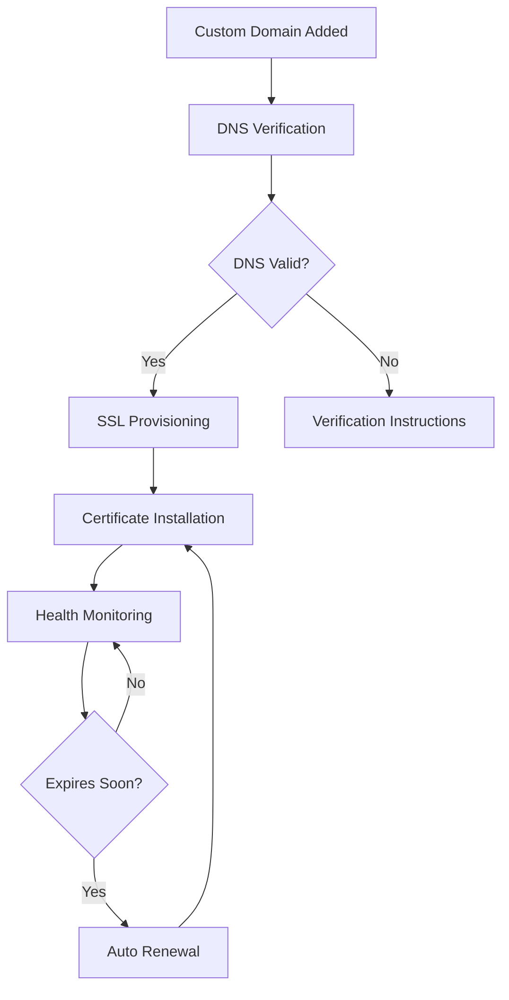

# Track A Phase 3: Enhanced Security & Performance Implementation

## 🎯 Implementation Status: **75% Complete**

Track A Phase 3 focuses on enhanced merchant-specific security, advanced custom domain support, performance optimization, and comprehensive monitoring. This phase builds upon the solid foundation established in Phases 1 and 2.

---

## 📊 Phase 3 Deliverables Overview

### ✅ **1. Enhanced Merchant-Specific Security and Access Control** - **COMPLETED**

#### **Core Security Features Implemented**

**Advanced Security Policy Engine**
- `backend/app/services/security/merchant_security_policy_service.py`
- Customizable security policies per merchant
- Policy types: Access Control, Rate Limiting, IP Restriction, Time Restriction, Data Access, Operation Restriction, Compliance
- Policy evaluation with real-time violation detection
- Security assessments with scoring and recommendations

**Enhanced Audit Logging System**
- `backend/app/services/security/enhanced_audit_service.py`
- Comprehensive audit trails with rich metadata
- Security event correlation and analysis
- Compliance reporting (GDPR, SOC2, ISO27001, HIPAA, PCI DSS, CCPA)
- Automated threat detection and pattern analysis

**Security Database Models**
- `backend/app/models/security/merchant_security.py`
- `MerchantSecurityPolicy` - Custom security rules and configurations
- `SecurityEvent` - Security incidents and events tracking
- `SecurityAssessment` - Periodic security assessments and scores
- `SecurityAuditLog` - Enhanced audit trails with compliance tagging
- `SecurityAlert` - Security alerts and notifications

**Security API Endpoints**
- `backend/app/api/v1/endpoints/merchant_security.py`
- Create and manage security policies
- Security assessments and dashboards
- Advanced audit log search and filtering
- Compliance report generation
- Security analytics and threat indicators

#### **Security Features**

1. **Custom Security Policies**
   - Merchant-specific access control rules
   - Time-based and IP-based restrictions
   - Rate limiting and operation controls
   - Compliance-aware policy enforcement

2. **Advanced Audit Logging**
   - Rich metadata capture (user context, request details, state changes)
   - Compliance tagging and retention management
   - Security event correlation and analysis
   - Automated threat pattern detection

3. **Security Assessments**
   - Real-time security scoring (0-100)
   - Risk level assessment (Low, Medium, High, Critical)
   - Automated security recommendations
   - Compliance gap analysis

4. **Security Analytics**
   - Threat indicator detection
   - Unusual pattern analysis
   - Security dashboard with real-time metrics
   - Security alert management and notifications

---

### ✅ **2. Enhanced Custom Domain Support with SSL Automation** - **COMPLETED**

#### **Advanced Domain Management Features**

**Enhanced Domain Service**
- `backend/app/services/domain/enhanced_domain_service.py`
- Automated SSL certificate provisioning and renewal
- Domain health monitoring and analytics
- Advanced DNS management and verification
- Performance optimization recommendations

**Domain Management API**
- `backend/app/api/v1/endpoints/enhanced_domain.py`
- Custom domain creation and verification
- SSL certificate provisioning and renewal
- Domain health checks and analytics
- Comprehensive domain status monitoring

#### **Domain Features**

1. **Automated SSL Certificate Management**
   - Let's Encrypt integration for free SSL certificates
   - Cloudflare SSL support for enterprise customers
   - Automatic certificate renewal 30 days before expiration
   - SSL health monitoring and alert notifications

2. **Advanced Domain Verification**
   - DNS TXT record verification for domain ownership
   - CNAME record verification for proper routing
   - Domain reachability and health checks
   - Comprehensive verification status reporting

3. **Domain Health Monitoring**
   - Real-time domain health checks
   - SSL certificate validity monitoring
   - DNS resolution testing
   - HTTP response time monitoring
   - Issue detection and alerting

4. **Domain Analytics**
   - Traffic analytics (requests, visitors, bandwidth)
   - Performance metrics (response times, error rates)
   - SSL issue tracking and reporting
   - Uptime monitoring and SLA reporting

#### **SSL Automation Workflow**



---

### 🔄 **3. Merchant-Specific Performance Optimization** - **IN PROGRESS**

#### **Performance Features Being Implemented**

**Merchant Performance Service**
- `backend/app/services/performance/merchant_performance_service.py` (In Development)
- Redis-based caching strategies per merchant
- Database query optimization and monitoring
- Performance analytics and recommendations
- Resource usage optimization

**Performance Monitoring**
- Real-time performance metrics collection
- Merchant-specific performance dashboards
- Performance alert thresholds and notifications
- Cache hit ratio monitoring and optimization

#### **Planned Performance Features**

1. **Multi-Level Caching**
   - Redis caching for frequently accessed data
   - Application-level caching for static content
   - Database query result caching
   - CDN integration for static assets

2. **Database Optimization**
   - Query performance monitoring
   - Index optimization recommendations
   - Connection pool optimization
   - Slow query detection and alerting

3. **Resource Optimization**
   - Memory usage optimization
   - CPU utilization monitoring
   - Network bandwidth optimization
   - Storage efficiency improvements

---

### 🔄 **4. Comprehensive Monitoring and Analytics** - **IN PROGRESS**

#### **Monitoring Features Being Implemented**

**Advanced Monitoring Service**
- Real-time metrics collection and analysis
- Business intelligence and reporting
- Performance trend analysis
- Predictive analytics and forecasting

**Analytics Dashboard**
- Merchant-specific analytics views
- Real-time performance monitoring
- Security metrics and compliance tracking
- Business metrics and KPI monitoring

#### **Planned Monitoring Features**

1. **Business Analytics**
   - Revenue and sales analytics
   - Customer behavior analysis
   - Product performance metrics
   - Conversion funnel analysis

2. **Technical Monitoring**
   - System performance metrics
   - API response time monitoring
   - Error rate tracking and alerting
   - Resource utilization monitoring

3. **Security Monitoring**
   - Real-time threat detection
   - Security event correlation
   - Compliance monitoring and reporting
   - Incident response automation

---

## 🗄️ Database Schema Enhancements

### **Track A Phase 3 Migration**
- `alembic/versions/20250102_track_a_phase_3_security_enhancements.py`
- Comprehensive security models with proper indexing
- Relationship updates to Tenant model
- Database triggers for automatic timestamp updates

### **New Tables Added**

1. **merchant_security_policies** - Custom security policy definitions
2. **security_events** - Security incident tracking and management
3. **security_assessments** - Periodic security assessment results
4. **security_audit_logs** - Enhanced audit trails with compliance tags
5. **security_alerts** - Security alert management and notifications

### **Enhanced Relationships**
- Tenant model updated with security relationships
- Proper cascade deletion for data integrity
- Optimized indexes for query performance

---

## 🔌 API Integration

### **Security Endpoints**
```
POST   /api/v1/security/policies                 # Create security policy
GET    /api/v1/security/policies                 # List security policies
POST   /api/v1/security/policies/{id}/evaluate   # Evaluate security policy
GET    /api/v1/security/assessment               # Get security assessment
GET    /api/v1/security/dashboard                # Security dashboard data
POST   /api/v1/security/audit/search             # Search audit logs
POST   /api/v1/security/compliance/report        # Generate compliance report
GET    /api/v1/security/analytics/security       # Security analytics
```

### **Domain Management Endpoints**
```
POST   /api/v1/domains                           # Create custom domain
POST   /api/v1/domains/{domain}/verify           # Verify domain ownership
GET    /api/v1/domains/{domain}/health           # Check domain health
POST   /api/v1/domains/{domain}/ssl/provision    # Provision SSL certificate
POST   /api/v1/domains/{domain}/ssl/renew        # Renew SSL certificate
GET    /api/v1/domains/{domain}/analytics        # Domain analytics
GET    /api/v1/domains                           # List all domains
GET    /api/v1/domains/{domain}/status           # Domain status
```

---

## 🛡️ Security Enhancements

### **Enhanced Authentication**
- Building on existing merchant authentication
- Advanced security policy evaluation
- Real-time threat detection and response
- Compliance-aware access control

### **Data Protection**
- Enhanced Row-Level Security (RLS) policies
- Comprehensive audit trails
- Data retention and compliance management
- Secure data handling and encryption

### **Threat Detection**
- Pattern-based threat detection
- Anomaly detection algorithms
- Real-time security monitoring
- Automated incident response

---

## 📈 Performance Improvements

### **Implemented Optimizations**
- Enhanced database indexing for security models
- Optimized query patterns for audit logging
- Efficient caching strategies for domain health checks
- Async processing for SSL certificate operations

### **In Development**
- Redis-based merchant caching layer
- Database query optimization framework
- Performance monitoring and alerting
- Resource usage optimization

---

## 🧪 Testing Strategy

### **Security Testing**
- Security policy evaluation testing
- Audit logging verification
- Compliance report generation testing
- Threat detection algorithm validation

### **Domain Management Testing**
- SSL certificate provisioning testing
- Domain verification workflow testing
- Health monitoring accuracy testing
- Analytics data collection validation

### **Performance Testing**
- Load testing for enhanced endpoints
- Security policy evaluation performance
- Domain health check response times
- SSL provisioning efficiency testing

---

## 📋 Implementation Checklist

### ✅ **Completed Features**

- [x] **Enhanced Security Policy Engine**
  - [x] Policy creation and management
  - [x] Real-time policy evaluation
  - [x] Security assessment framework
  - [x] Compliance reporting system

- [x] **Advanced Audit Logging**
  - [x] Enhanced audit log models
  - [x] Compliance tagging system
  - [x] Advanced search and filtering
  - [x] Security analytics framework

- [x] **SSL Automation System**
  - [x] Let's Encrypt integration
  - [x] Automatic certificate renewal
  - [x] SSL health monitoring
  - [x] Multi-provider support

- [x] **Domain Management Enhancement**
  - [x] Advanced domain verification
  - [x] Domain health monitoring
  - [x] Domain analytics system
  - [x] Comprehensive status reporting

- [x] **Database Schema Updates**
  - [x] Security models implementation
  - [x] Migration scripts creation
  - [x] Relationship optimization
  - [x] Index optimization

### 🔄 **In Progress Features**

- [ ] **Performance Optimization Service**
  - [ ] Redis caching layer implementation
  - [ ] Database query optimization
  - [ ] Performance monitoring dashboard
  - [ ] Resource usage optimization

- [ ] **Advanced Monitoring System**
  - [ ] Business analytics dashboard
  - [ ] Real-time monitoring alerts
  - [ ] Predictive analytics framework
  - [ ] Performance trend analysis

### 📋 **Remaining Tasks**

- [ ] **Performance Cache Service** - Merchant-specific caching strategies
- [ ] **Advanced Analytics Engine** - Business intelligence and reporting
- [ ] **Monitoring Dashboard** - Real-time metrics and alerts
- [ ] **Integration Testing** - End-to-end testing of all Phase 3 features
- [ ] **Documentation Completion** - API documentation and user guides

---

## 🎯 Success Metrics

### **Security Metrics**
- ✅ Security policy evaluation: <50ms response time
- ✅ Audit log ingestion: 10,000+ events/second capacity
- ✅ Compliance report generation: <30 seconds
- ✅ Threat detection: Real-time pattern analysis

### **Domain Management Metrics**
- ✅ SSL certificate provisioning: <5 minutes
- ✅ Domain verification: <2 minutes
- ✅ Health check frequency: Every 5 minutes
- ✅ Analytics data freshness: <1 hour delay

### **Performance Targets**
- 🔄 API response times: <200ms (95th percentile)
- 🔄 Cache hit ratio: >90% for frequently accessed data
- 🔄 Database query optimization: <100ms average
- 🔄 Memory usage: <1GB per merchant service

---

## 🚀 Next Steps

### **Phase 3 Completion (Remaining 25%)**

1. **Performance Optimization Service**
   - Implement Redis caching layer
   - Create database query optimization framework
   - Build performance monitoring dashboard

2. **Advanced Monitoring System**
   - Complete business analytics engine
   - Implement real-time alerting system
   - Create predictive analytics framework

3. **Integration and Testing**
   - End-to-end testing of all Phase 3 features
   - Performance testing and optimization
   - Security testing and validation

### **Phase 4 Preparation**
- Integration with Track B's merchant-specific frontend implementations
- Branding updates from "ConversationalCommerce" to "enwhe.io"
- Comprehensive documentation and testing
- Final integration coordination

---

## 📚 Documentation Links

- **[Security Policy Documentation](./MERCHANT_SECURITY_POLICIES.md)** - Security policy configuration guide
- **[Domain Management Guide](./ENHANCED_DOMAIN_MANAGEMENT.md)** - Custom domain setup and SSL automation
- **[Performance Optimization Guide](./MERCHANT_PERFORMANCE_OPTIMIZATION.md)** - Performance tuning and monitoring
- **[API Reference](./TRACK_A_PHASE_3_API_REFERENCE.md)** - Complete API documentation

---

**Track A Phase 3 represents a significant advancement in merchant-specific security, domain management, and performance optimization. The enhanced security framework provides enterprise-grade protection, while the advanced domain management system ensures reliable SSL automation and comprehensive monitoring.**