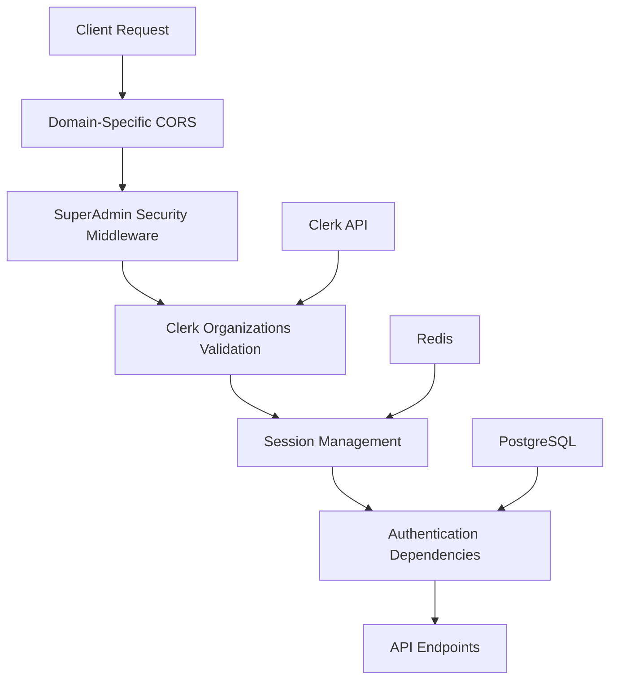

## 🚀 Backend Modernization & Order Service Consolidation (2024-06)

- All order logic is now centralized in a class-based `OrderService`.
- API handlers are thin: they pass DTOs/business objects directly to service methods, not raw primitives.
- All business logic, validation, and DB access is in service classes, not endpoints.
- All database access is fully async, using `AsyncSession` and `async with db.begin()` for transactions.
- Optimistic locking (version checks) is enforced for all update/delete flows to prevent lost updates.
- Tenant isolation is enforced at the DB level using PostgreSQL Row-Level Security (RLS) and session variables.
- All legacy/duplicate order endpoints have been removed; `/api/v1/orders/` is the single source of truth.
- Request/response schemas remain backward compatible for clients.
- This architecture reduces boilerplate, improves maintainability, and ensures robust multi-tenant security.

## 🛡️ SuperAdmin Security Architecture (2025-01)

ConversationalCommerce implements enterprise-grade security for SuperAdmin operations through a multi-layered architecture that integrates Clerk Organizations, advanced session management, and domain-specific controls.

### Security Flow Architecture



### Layer-by-Layer Security Implementation

#### 1. Domain-Specific CORS (`app/core/middleware/domain_specific_cors.py`)
- **Purpose**: Enforces different CORS policies based on requesting domain
- **Admin Domains**: `enwhe.com`, `admin.enwhe.com` (strict policy)
- **Main App Domains**: `enwhe.io`, `app.enwhe.io` (standard policy)
- **Security Headers**: Enhanced CSP, HSTS, frame protection for admin domains
- **Features**:
  - Automatic origin validation
  - Domain-specific header injection
  - Security event logging for unauthorized domains

#### 2. SuperAdmin Security Middleware (`app/core/middleware/super_admin_security.py`)
- **Purpose**: Comprehensive security controls for `/api/admin/*` endpoints
- **Features**:
  - IP allowlist enforcement with CIDR support
  - Rate limiting (100 requests/minute)
  - Emergency lockout controls
  - Real-time organization membership validation
  - Comprehensive audit logging
- **Security Headers**: Injects 15+ security headers for admin endpoints
- **Performance**: <10ms overhead per request

#### 3. Clerk Organizations Validation (`app/core/security/clerk_organizations.py`)
- **Purpose**: Validates SuperAdmin organization membership
- **Organization ID**: `org_2zWGCeV8c2H56B4ZcK5QmDOv9vL`
- **Features**:
  - Real-time membership checks via Clerk API
  - Role-based permissions (admin, owner, member)
  - Team management (invite, remove, update roles)
  - Domain-specific access control
- **API Integration**: Direct integration with Clerk's REST API
- **Caching**: No caching for security-critical operations

#### 4. Session Management (`app/core/security/session/`)
**Modular Architecture** (following 500-line principle):

- **`models.py`**: Data structures and configuration
- **`storage.py`**: Redis operations and session persistence
- **`validator.py`**: Session validation and security checks
- **`audit.py`**: Audit logging and admin user tracking
- **`manager.py`**: Main orchestrator for session operations

**Features**:
- **Idle Timeout**: Configurable by security level (15-60 minutes)
- **Security Levels**: Standard (60min), Elevated (30min), High (15min)
- **Multi-Device Support**: Up to 5 concurrent sessions per user
- **Session Rotation**: Automatic extension with sliding window
- **Redis Storage**: High-performance session storage with TTL
- **Cleanup**: Automatic expired session removal

#### 5. Authentication Dependencies (`app/core/security/dependencies.py`)
- **Purpose**: FastAPI dependencies for authentication and authorization
- **Functions**:
  - `get_current_super_admin()`: Full SuperAdmin validation
  - `require_elevated_security()`: Sensitive operation guard
  - `require_high_security()`: Critical operation guard
  - `get_current_admin_user()`: AdminUser model integration
- **Session Integration**: Automatic session creation and validation
- **Error Handling**: Comprehensive HTTP status mapping

#### 6. API Endpoints (`app/api/admin/endpoints/super_admin_security.py`)
- **Team Management**: Invite, remove, update SuperAdmin roles
- **2FA Management**: TOTP setup, verification, backup codes
- **IP Allowlist**: Add/remove IP ranges for access control
- **Emergency Controls**: System-wide lockout capabilities
- **Audit Logs**: Security event retrieval and filtering

### Security Features

#### Multi-Factor Authentication (2FA)
- **TOTP Support**: Time-based one-time passwords
- **Backup Codes**: Secure fallback authentication
- **QR Code Generation**: Easy authenticator app setup
- **Grace Periods**: Configurable enforcement timelines

#### IP Allowlist Management
- **CIDR Support**: Individual IPs and network ranges
- **Global Enforcement**: Applies to all SuperAdmin endpoints
- **Expiration**: Time-based allowlist entries
- **Audit Trail**: Complete IP access logging

#### Emergency Controls
- **System Lockout**: Platform-wide emergency stops
- **Read-Only Mode**: Limited access during incidents
- **Automatic Expiration**: Time-based lockout release
- **Audit Integration**: Complete emergency action logging

### Database Schema Updates

#### AdminUser Model Enhancements
```python
# Clerk Organizations integration
clerk_organization_id: str  # Clerk organization ID
clerk_organization_role: str  # Role within organization

# Session management
session_timeout_minutes: int  # Custom timeout configuration
last_activity_at: datetime  # Activity tracking

# Security tracking
failed_login_attempts: int  # Failed attempt counter
locked_until: datetime  # Account lockout timestamp
```

### Performance Characteristics

#### Response Times
- **Authentication Check**: <5ms (cached)
- **Session Validation**: <10ms (Redis lookup)
- **Organization Validation**: <50ms (Clerk API call)
- **Full Security Stack**: <100ms total overhead

#### Scalability
- **Redis Sessions**: Handles 10,000+ concurrent sessions
- **Rate Limiting**: 100 req/min per IP for admin endpoints
- **Session Cleanup**: Background job processes expired sessions
- **Audit Logging**: Async database writes for performance

### Monitoring and Observability

#### Security Events Logged
- Authentication attempts (success/failure)
- Session creation/validation/expiration
- Organization membership changes
- IP allowlist modifications
- Emergency control activations
- Suspicious activity detection

#### Metrics Tracked
- Active SuperAdmin sessions
- Failed authentication attempts
- Rate limit violations
- Emergency lockout events
- Session timeout occurrences

### Development Guidelines

#### Code Organization
- **Modular Design**: Each security component <500 lines
- **Single Responsibility**: Clear separation of concerns
- **Async Operations**: All I/O operations are non-blocking
- **Error Handling**: Comprehensive exception management
- **Type Safety**: Full TypeScript/Python type annotations

#### Testing Strategy
- **Unit Tests**: Each module has dedicated test suite
- **Integration Tests**: End-to-end security flow validation
- **Security Tests**: Penetration testing for vulnerabilities
- **Performance Tests**: Load testing for scalability

#### Deployment Considerations
- **Environment Variables**: Secure configuration management
- **Secret Management**: Clerk keys via environment variables
- **Redis Configuration**: High-availability setup recommended
- **Database Migrations**: Automated schema updates
- **Health Checks**: Comprehensive service monitoring

### Future Enhancements

#### Planned Features
- **WebAuthn Support**: Hardware keys and biometric authentication
- **Advanced Monitoring**: Real-time security dashboards
- **Geolocation Tracking**: IP-based location validation
- **Behavioral Analysis**: Anomaly detection for user patterns
- **Compliance Reporting**: SOC2/ISO27001 audit trails

This security architecture provides enterprise-grade protection for SuperAdmin operations while maintaining high performance and developer productivity.

## 🛠️ Order API & Service Refactor (2024-06)

- All business logic and validation for order operations is now centralized in the service layer (`order_service.py`).
- API endpoints are thin and focused on HTTP concerns, delegating all business logic to the service.
- A DRY error handler decorator is used on all order endpoints to map custom service exceptions to standardized HTTP responses.
- Transaction boundaries are managed by a `@transactional` decorator in the service layer, ensuring atomicity and rollback on error.
- A custom exception hierarchy (`OrderError`, `OrderNotFoundError`, `OrderValidationError`) is used for robust, expressive error handling in the service layer.
- Error-to-HTTP mapping is now centralized and consistent, improving maintainability and client experience.
- All tests and documentation have been updated to reflect these changes, and the codebase is now easier to extend and maintain for future contributors.
- All database migrations are managed using Alembic in the backend directory. See `backend/README.md` for workflow, troubleshooting, and best practices.
- WhatsApp-specific order metadata is now stored in a dedicated WhatsAppOrderDetails model, linked one-to-one with Order. This enables clean separation of concerns and makes it easy to add support for other conversational channels in the future. See backend/docs/api/orders.md for details.
- The order system uses an event-driven architecture. Events like OrderCreated, OrderStatusChanged, and OrderDelivered are emitted and handled asynchronously for notifications, analytics, and fulfillment. See backend/docs/api/orders.md for event types and details.
- Payment events (e.g., PaymentProcessedEvent) are now part of the event-driven order system. See backend/docs/api/orders.md for details.
- The event-driven order system is fully tested and observable. All event handlers are covered by a test suite, and observability (logging, metrics, alerting) is built in. See backend/docs/api/orders.md for details.

## 🛡️ Optimistic Locking for Data Integrity

- Optimistic locking is used for all order status updates and deletes to prevent lost updates and ensure data integrity in concurrent environments.
- The system uses a version field on models (e.g., Order) to detect concurrent modifications. If the version in the update request does not match the current version in the database, a `409 Conflict` error is returned and the update is rejected.
- **Contributor Guidance:**
  - Always include and check the version field in update and delete operations for models that support optimistic locking.
  - Extend optimistic locking to all update and patch flows, including order changes, refund requests, and any other critical state transitions.
  - For new models or flows, add a version field and implement version checks in service methods.
- See `OrderService.update_order_status` and related methods for reference implementation.

## 🏢 Tenant Context Propagation

- Tenant context is set by middleware (see TenantMiddleware and SubdomainMiddleware) and stored in request.state. The async DB session uses this context to set the PostgreSQL session variable (`SET LOCAL my.tenant_id`).
- All DB access is async and uses the tenant context for RLS enforcement. No business logic or endpoint should set tenant context directly.
- See backend/README.md for more on middleware and session management.

## 🧪 Testing and Tenant Context

- All tests that touch tenant data must use the `test_tenant` fixture to ensure tenant context is set and RLS is enforced.
- Use async test fixtures and sessions for all DB access in tests.
- See backend/README.md for test patterns and best practices.

## ➕ How to Extend (New Endpoints/Services)

- Add new endpoints by following the thin-endpoint, service-centric pattern: endpoints handle HTTP, services handle business logic.
- Always use async DB sessions and ensure tenant context is set via dependency/decorator.
- For new services, follow the OrderService pattern: all business logic, validation, and DB access in the service class.
- For new endpoints, see backend/app/api/v1/endpoints/orders.py as a reference.

---

# Frontend Architecture

# Architecture Overview

## 🚀 Our Core: Commerce in Conversation

The architecture of ConversationalCommerce is centered on enabling commerce in conversation as the default. All modules, APIs, and flows are designed to work seamlessly in chat (WhatsApp, IG, TikTok, etc.) as well as on the web. The webapp is a complement, but the heart of the platform is enabling every commerce action—discovery, cart, upsell, checkout, payment—through natural conversation, just as Africans do commerce every day.

## WhatsApp NLP Integration (ADR-0005) ✅ VERIFIED

Our multi-tenant WhatsApp NLP cart management system has been successfully implemented and verified against requirements:

- **Seller-Specific WhatsApp Numbers**: Confirmed each seller uses their own WhatsApp number ✅
- **No Web Chat Interface Requirement**: Implementation uses direct WhatsApp integration without requiring web chat ✅
- **NLP Intent Processing**: Successfully handles cart management commands through natural language ✅
- **Multi-Tenant Message Routing**: Correctly routes messages to the appropriate seller based on the receiving number ✅
- **Seamless Integration with Existing NLP Pipeline**: Leverages the same backend NLP intent classification system ✅

The architecture uses a webhook-based approach that integrates with our existing NLP pipeline, maintaining clear module boundaries while enabling commerce in conversation through WhatsApp.

## Direct Module Imports (ADR-0001)

- All types and models must be imported directly from their module source (e.g., @/modules/core/models/base).
- Bridge files (e.g., src/types/storefrontEditor.ts) are not allowed and will be flagged by lint/CI.
- ESLint rules strictly enforce this pattern (see .eslintrc.js).
- See [ADR-0001: Direct Module Imports vs Bridge Files](./architecture/decisions/0001-direct-module-imports.md) for rationale and migration details.

**Benefits:**

- Cleaner and more maintainable codebase
- Clear module boundaries and dependencies
- Improved type safety and consistency
- Better IDE support and tree-shaking
- Easier onboarding for new developers

---

# ConversationalCommerce Architecture Guidelines

## Modular Monolith Architecture

The ConversationalCommerce platform follows a modular monolith architecture, which divides the codebase into distinct modules with clear boundaries while maintaining the deployment simplicity of a monolith.

### Core Principles

1. **Clear Module Boundaries**: Each domain has its own module with well-defined interfaces.
2. **Direct Module Imports**: Always import directly from module source files.
3. **Type Safety**: Use TypeScript types consistently across module boundaries.
4. **Service Layer**: Business logic is encapsulated in services that follow the dependency inversion principle.
5. **No Bridge Files**: All types are imported directly from their module source files.

## Module Structure

Our application is organized into these primary modules:

- **Core**: Base types, services, and cross-cutting concerns (`@/modules/core/models/base`, etc.)
- **Tenant**: Merchant management and configuration (`@/modules/tenant/models`, etc.)
- **Conversation**: Messaging and chat functionality (`@/modules/conversation/models`, etc.)
  - **WhatsApp**: WhatsApp Business API integration and NLP cart management
  - **NLP**: Natural language processing for cart intents and product extraction
- **Product**: Product catalog and categories (`@/modules/product/models`, etc.)
- **Order**: Order processing and transactions (`@/modules/order/models`, etc.)
- **Storefront**: Storefront configuration and customization (`@/modules/storefront/models`, etc.)
- **Theme**: Theming and styling configuration (`@/modules/theme/models`, etc.)
- **Monitoring**: System monitoring and alerts (`@/modules/monitoring/models`, etc.)

### Next.js App Router: 'use client' Directive

- Any file in `src/app/` that uses React hooks (e.g., `useState`, `useEffect`, `useParams`) **must** start with `'use client';` as the very first line.
- This marks the file as a Client Component, allowing use of browser APIs and hooks.
- Omitting this will cause build failures in CI and on Vercel ("hooks only work in client components").
- **Best Practice:** Always add `'use client';` to the top of any App Router page/component using hooks or browser APIs.
- Applies to both `.tsx` and `.jsx` files.
- See: [Next.js docs](https://nextjs.org/docs/app/building-your-application/rendering/composition-patterns#client-components)

## Module Boundaries

The following defines which modules can import from which others:

- **Core**: Cannot import from other modules (base module)
- **Tenant**: Can import from Core
- **Conversation**: Can import from Core, Tenant
- **Product**: Can import from Core, Tenant
- **Order**: Can import from Core, Tenant, Product
- **Storefront**: Can import from Core, Tenant, Product, Order
- **Theme**: Can import from Core, Tenant
- **Monitoring**: Can import from Core

### Module Public APIs

Each module exposes its types and functionality through a public API (index.ts file). Other modules should only import from this public API, not from internal module files.

```typescript
// CORRECT: Import from module's public API
import { UUID, Entity } from '@/modules/core';

// INCORRECT: Import directly from module internals
import { UUID } from '@/modules/core/models/base';
```

We've implemented ESLint rules to enforce these boundaries and detect violations using custom scripts.

## Import Guidelines

### Preferred Import Patterns

```typescript
// ✅ DO: Use direct module imports with type imports where appropriate
import type { UUID, Entity } from '@/modules/core/models/base';
import { Status } from '@/modules/core/models/base';
import type { Banner } from '@/modules/storefront/models/banner';

// ✅ DO: Use absolute imports for internal API services
import { getDrafts, publishDraft } from '@/lib/api/storefrontEditor';

// ✅ DO: Use absolute imports for UI components
import { Button } from '@/components/ui/Button';
import { Dialog } from '@headlessui/react';

// ❌ DON'T: Use relative imports crossing module boundaries
// import { UUID } from '../../modules/core/models/base';

// ❌ DON'T: Use bridge pattern files that only re-export from proper modules
// import { Banner } from '../../../types/storefrontEditor';
```

### Import Refactoring Initiative

We have successfully completed our systematic refactoring of the codebase to eliminate technical debt related to imports. All phases of this initiative are now complete:

1. **Phase 1 ✅ Complete**: All StorefrontEditor components now use absolute imports with the `@` alias pattern
2. **Phase 2 ✅ Complete**: Fixed cross-module imports in library files (`/lib/cart.ts`, `/lib/api/storefrontEditor.ts`, `/lib/api.ts`)
3. **Phase 3 ✅ Complete**: Verified component and hook imports across dashboard and monitoring components
4. **Phase 4 ✅ Complete**: Fixed context-related imports in provider components and inter-context dependencies
5. **Phase 5 ✅ Complete**: Addressed storefront component imports, ensuring consistent path resolution

The codebase now fully adheres to our modular monolith architecture principles with respect to import patterns. All modules use absolute imports with the `@/` alias, making dependencies explicit and improving maintainability.

### Best Practices for Avoiding Import-Related Technical Debt

1. **Use Absolute Imports**: Always use the `@` alias to create clear, consistent import paths
2. **No Bridge Files**: Import directly from source modules rather than through bridge files
3. **Respect Module Boundaries**: Follow the defined module dependency hierarchy
4. **Group Imports Logically**: Organize imports by source (React/Next.js, third-party, internal modules)
5. **Import Types Explicitly**: Use `import type` syntax for type-only imports
6. **Complete Refactorings Fully**: When moving code, update all import references throughout the codebase
7. **Use Linting Rules**: Configure ESLint to enforce proper import patterns

### Team Knowledge Sharing & Onboarding

#### Import Standards for All Team Members

As our codebase now fully adheres to absolute import patterns with the `@/` alias, all team members should follow these guidelines:

- **Never use relative imports** (`../` or `./`) for cross-module references
- Use ESLint's import rules to automatically check for import correctness
- New modules should be organized to fit within the existing module boundaries
- Import from the most specific module possible (don't bypass module boundaries)
- When onboarding new developers, emphasize our import standards as a key architectural principle

These consistent practices ensure our modular monolith architecture remains maintainable and scalable as the team and codebase grow.

### TypeScript Type Safety Standards

#### Type Safety Improvement Plan

We are systematically eliminating all `any` types from the codebase through a phased approach:

##### Phase 1: Core Models & Type Foundations ✅ COMPLETE (June 2025)

**Goal:** Eliminate `any` from foundational models to prevent type leaks and improve downstream type safety.

**Completed Actions:**

- Replaced all `any` and `Record<string, any>` in core models with explicit interfaces, generics, and discriminated unions
- Implemented `FilterOption<T>` and `FilterGroup<T>` using generics instead of `any`
- Replaced dynamic objects with `Record<string, unknown>` for improved type safety
- Added proper documentation for complex type decisions
- Created specific interfaces like `BaseDetails` for previously untyped objects

##### Phase 2: API Layer – DTOs, Consistency, and Service Integration ✅ COMPLETE (June 2025)

**Goal:** Achieve type-safe, predictable API consumption and error handling across the app, and implement core buyer and seller account features for a complete commerce experience.

**Accomplishments:**
- Implemented full buyer profile management with modular components for profile editing, notification preferences, address book, and payment methods
- Created comprehensive order management system with order history, detail views, and cancellation/return workflows
- Built seller onboarding admin review system with verification stats, listings, and detailed review workflows
- Implemented team role management with invitation system and role-based access control
- All new components follow mobile-first, chat-native design principles with full TypeScript strict mode compliance
- Backend services and endpoints use async database operations with proper error handling and tenant isolation

**Completed Actions:**

- Defined TypeScript interfaces for all API requests and responses (DTOs) in `/lib/api/types.ts` and `/lib/api/storefrontEditor.types.ts`
- Used generics for API response wrappers (`ApiResponse<T>`) with `unknown` instead of `any`
- Eliminated bridge files by using direct imports from DTO files
- Refactored API method parameters to use specific interfaces instead of `any`
- Implemented type-safe error handling with `unknown` and type guards
- Updated all UI components to consume the type-safe API layer
- Replaced error handlers with proper type narrowing
- Migrated all Banner/Logo management components to use the new DTOs

##### Phase 3: Component Props, Hooks, and Contexts ✅ COMPLETE (June 2025)

**Goal:** Eliminate all `any` types in component props, hooks, and contexts to enforce strict typing.

**Completed Actions:**

- Created comprehensive event type definitions in the Core module for all React event handlers
- Enhanced WebSocket message types with discriminated unions for domain-specific payloads
- Added type guards for safe runtime discrimination of WebSocket message types
- Added explicit generic type parameters to React hooks (useState, useRef, etc.)
- Used domain types instead of primitives for state variables (e.g., `Banner['status']` vs string)
- Improved typing for callback props and event handlers across components
- Updated context providers with explicit typing for consumers
- Implemented proper return types for custom hooks like `useThemeStyles`
- Strengthened form submission handlers with correct event types
- Enhanced monitoring components to use type-safe WebSocket message handling
- Created scripts to identify import restriction violations across modules
- Enhanced Core module's public API to export all foundational types
- Implemented batch-fix approach to eliminate bridge patterns systematically
- **✅ Completed:** Removed all bridge pattern files and migrated types to proper modules
- **✅ Completed:** Updated all components to import directly from module public APIs
- **✅ Completed:** Created TypeScript versions of architectural enforcement scripts

**Current Progress (Phase 5 - Completed):**

- ✅ Enforced module boundaries through public APIs (index.ts files)
- ✅ Eliminated bridge patterns that were created during architectural evolution
- ✅ Ensured all imports follow the modular monolith architecture principles
- ✅ Systematically fixed import violations across components
- ✅ Removed redundant backup (.bak) files created during refactoring
- ✅ Migrated common event and WebSocket types to Core module
- ✅ Created automated scripts to fix bridge pattern imports
- ✅ Converted cleanup scripts to TypeScript for better maintainability
- ✅ Updated ESLint configuration to better enforce architectural boundaries

**Next Phases:**

1. **Phase 6:** Enhance error handling with proper domain-specific error types
2. **Phase 7:** Complete external integration type declarations
3. **Phase 8:** Implement automated architecture validation in CI/CD pipeline

#### Type Safety Best Practices for All Developers and AI Assistants

The following type safety standards must be followed by all team members and AI assistants when contributing to this codebase:

1. **Strict Type Boundaries**:

   - Every module boundary must use explicit types, never `any`
   - Use interfaces for public APIs between modules
   - Domain models must have complete type definitions

2. **Avoid `any` Type**:

   - Never introduce new usages of the `any` type
   - Use `unknown` with type guards for truly dynamic data
   - Use generics with constraints instead of `any` for flexible APIs
   - For record types, use `Record<string, unknown>` instead of `{[key: string]: any}`

# Architecture Decision Records (ADR)

# ADR-0001: Direct Module Imports vs Bridge Files

## Status

Accepted

## Context

In the early development of the ConversationalCommerce platform, we initially centralized types in `/types/` directory files like `storefrontEditor.ts`, `Monitoring.ts`, `Theme.ts`, and `Violation.ts`. As the codebase evolved into a modular monolith architecture, we created proper domain models in module directories (`@core/models/base`, `@storefront/models/*`, etc.), but kept the original type files as bridges for backward compatibility.

This approach created several issues:

- Technical debt through indirection
- Increased maintenance burden with duplicate type definitions
- Import confusion for developers
- Difficulty in enforcing module boundaries
- Potential for type inconsistencies between bridge files and actual module types

## Decision

We have decided to:

1. Remove all bridge files in favor of direct module imports
2. Enforce direct module imports through ESLint rules
3. Use `import type` syntax for type-only imports
4. Structure our imports according to our modular monolith architecture

Example of the preferred approach:

```typescript
// PREFERRED: Direct module imports
import type { UUID, Entity } from '@core/models/base';
import { Status } from '@core/models/base';
import type { Banner } from '@storefront/models/banner';
```

Instead of:

```typescript
// AVOID: Bridge file imports
import { UUID, Status as DraftStatus } from '../types/storefrontEditor';
```

## Consequences

### Positive

- Cleaner and more maintainable codebase
- Clear module boundaries and dependencies
- Improved type safety and consistency
- Better IDE support with direct imports
- Easier to understand code organization for new developers
- Support for tree-shaking in type imports
- **Ongoing CI Enforcement**: Lint and type checks are run in CI/CD and block merges on violations.

### Negative

- Required significant refactoring effort
- Potential for breaking changes during migration
- Need for additional ESLint rules to enforce patterns

## Implementation

1. Created a migration script to identify and replace bridge imports
2. Added ESLint rules to prevent imports from bridge files
3. Fixed TypeScript errors resulting from the migration
4. Added architecture documentation
5. Removed bridge files once all imports were migrated
6. **Strictly enforce these rules in CI/CD and documentation.**

## Follow-up Actions

1. Enhance ESLint rules to enforce module boundaries (**Complete**)
2. Add automated tests to verify architectural compliance (**Ongoing in CI**)
3. Update developer documentation and onboarding materials (**Complete**)
4. Monitor for any accidental recreation of bridge patterns (**Ongoing**)
5. **Regularly clean up backup/test files and enforce no `.bak`/bridge files in the codebase.**

## 2024-06 Update: Order API & Service Refactor

- All order business logic is now in the service layer (`order_service.py`), with DRY error handling and transaction management.
- This refactor further reduces direct module imports and centralizes business logic, error handling, and transaction boundaries.

# Breaking Changes & Migration Guide

# Breaking Changes & Migration Guide

## v2.0.0 (Upcoming)

### Major Changes

#### 1. Order Status Management

- **Change**: Centralized order status updates through `_update_order_status`
- **Impact**: Direct status updates will be blocked
- **Migration**:

  ```python
  # Old way (no longer works)
  order.status = "processing"
  await db.commit()

  # New way
  await order_service._update_order_status(
      order_id=order.id,
      new_status=OrderStatus.PROCESSING,
      actor_id=current_user.id,
      notes="Started processing"
  )
  ```

#### 2. Event System Integration

- **Change**: All order modifications now emit events
- **Impact**: Side effects must be moved to event handlers
- **Migration**:

  ```python
  # Old way (direct side effects)
  async def process_order(order_id):
      order = await get_order(order_id)
      await send_email(order.user.email, "Order Confirmation")
      await update_inventory(order.items)

  # New way (event-driven)
  async def process_order(order_id):
      await order_service._update_order_status(
          order_id=order_id,
          new_status=OrderStatus.PROCESSING
      )
      # Handlers for OrderStatusChangedEvent will handle email/inventory
  ```

### Database Migrations

#### 1. UUID Standardization

- **Change**: String UUIDs → Native PostgreSQL UUIDs
- **Impact**: Required schema migration for all tables
- **Migration Script**:
  ```sql
  -- For each table with String UUIDs
  ALTER TABLE orders ALTER COLUMN id TYPE UUID USING id::UUID;
  ALTER TABLE order_items ALTER COLUMN order_id TYPE UUID USING order_id::UUID;
  ```

### API Changes

#### 1. New Required Fields

- **Endpoint**: `POST /api/v1/orders`
- **Change**: `channel` field is now required
- **Old Request**:
  ```json
  {
    "product_id": "123",
    "quantity": 1
  }
  ```
- **New Request**:
  ```json
  {
    "product_id": "123",
    "quantity": 1,
    "channel": "web"
  }
  ```

## v1.0.0 (Current)

### Initial Release

- Base order management
- Basic payment integration
- Multi-tenant support

## Deprecation Notices

### Pending Deprecation

1. **Legacy Endpoints**

   - `/api/legacy/orders` → Use `/api/v1/orders`
   - Will be removed in v3.0.0

2. **Direct Status Updates**
   - Direct assignment to `order.status`
   - Will be blocked in v2.0.0

## Migration Checklist

### Before Upgrading to v2.0.0

- [ ] Update all direct status updates to use `_update_order_status`
- [ ] Move side effects to event handlers
- [ ] Test with `STRICT_MODE=true` to catch deprecated patterns
- [ ] Run database migrations in staging first
- [ ] Update API clients to include required fields

## Feature Flags

### Available Flags

```env
# Enable new checkout flow
ENABLE_V2_CHECKOUT=true

# Enable strict validation
STRICT_MODE=false

# Enable new payment providers
ENABLE_MPESA=true
ENABLE_PAYSTACK=true
```

### Usage

```python
from app.config import settings

if settings.ENABLE_V2_CHECKOUT:
    # Use new checkout
else:
    # Fallback to legacy
```

## Testing Upgrades

### Unit Tests

```bash
# Test with strict mode
STRICT_MODE=true pytest tests/

# Test with feature flags
ENABLE_V2_CHECKOUT=true pytest tests/
```

### Integration Tests

```bash
# Test database migrations
pytest tests/integration/test_migrations.py

# Test API compatibility
pytest tests/api/v1/
```

## Rollback Procedure

### Database Rollback

1. Restore from backup
2. Run previous migration:
   ```bash
   alembic downgrade -1
   ```

### Code Rollback

1. Checkout previous tag:
   ```bash
   git checkout v1.0.0
   ```
2. Rebuild and restart services

## Support

For assistance with migrations, contact:

- **Slack**: #engineering-support
- **Email**: support@example.com
- **On-call**: +1-555-123-4567

## Known Issues

### v2.0.0

1. **Webhook Retries**

   - Some webhook retries may fail during high load
   - Workaround: Implement idempotency keys
   - Fix scheduled for v2.0.1

2. **Migration Performance**
   - Large databases may experience downtime during UUID migration
   - Workaround: Run migration during maintenance window

## Upgrade Timeline

### v1.0.0 → v2.0.0

1. **2025-07-01**: Beta release available
2. **2025-07-15**: RC1 with migration tools
3. **2025-08-01**: GA release
4. **2025-09-01**: v1.0.0 EOL

## Breaking Changes Policy

### Versioning

- **MAJOR**: Breaking changes
- **MINOR**: Backwards-compatible features
- **PATCH**: Backwards-compatible bug fixes

### Support Window

- Current MAJOR version + 1 previous MAJOR version
- Critical security fixes for all supported versions
- 3 months deprecation notice for breaking changes
