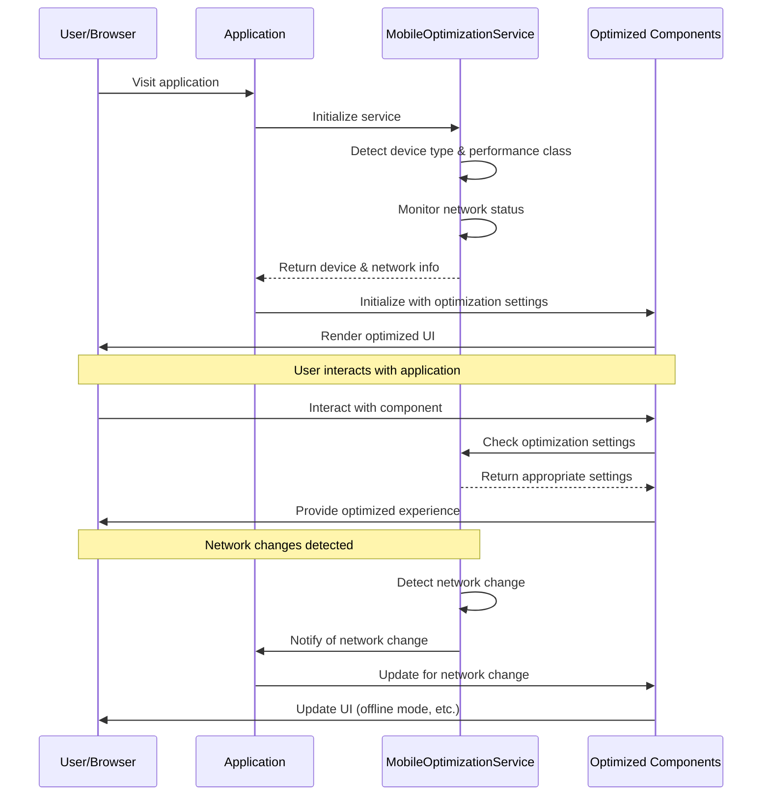
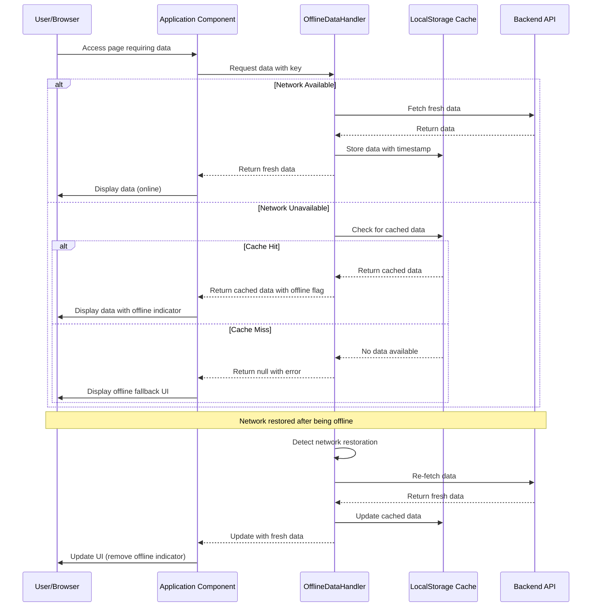
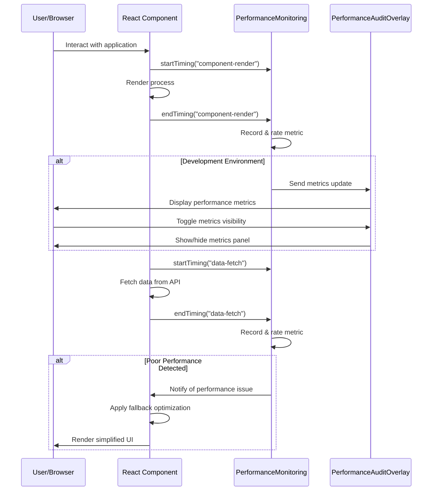
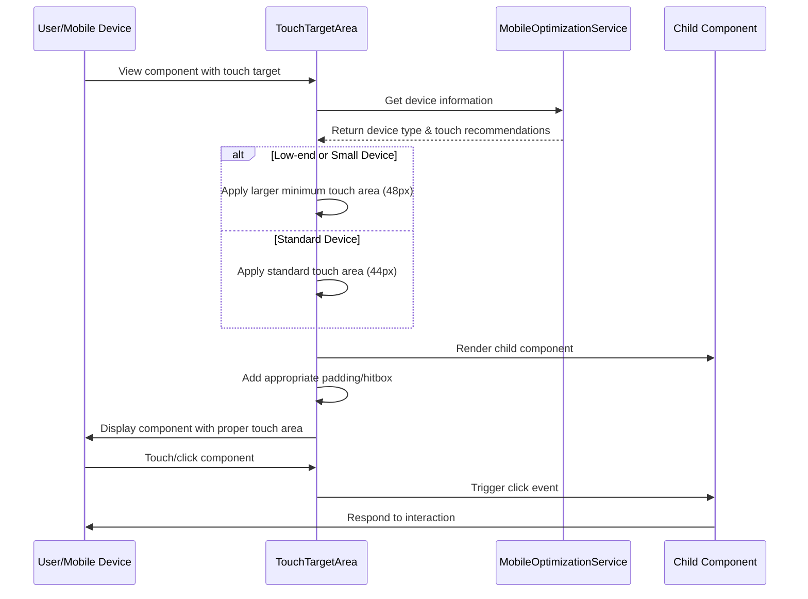
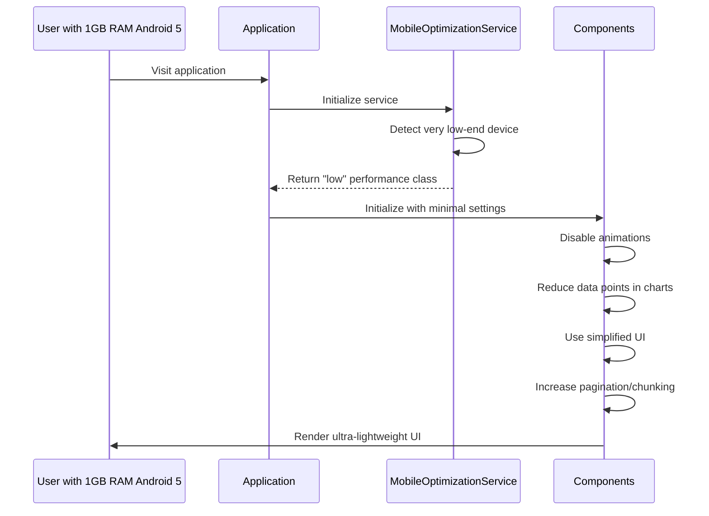
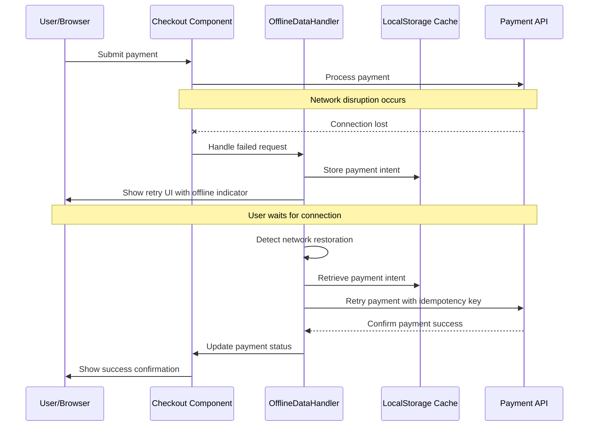

# Mobile Optimization Flows

This document contains sequence diagrams and explanations for the key user flows related to mobile optimization in the ConversationalCommerce platform.

## Device Detection and Optimization Flow

## Offline Data Handling Flow

## Performance Monitoring Flow

## Touch Target Optimization Flow

## Edge Cases

### Handling Extremely Low-end Devices

### Network Disruption During Critical Flow

## Implementation Notes

### Device Detection Strategy

The device detection relies on multiple signals to ensure accurate classification:

1. User Agent parsing for basic device type
2. Screen size and pixel ratio for display capabilities
3. Hardware concurrency and memory (where available) for performance class
4. Connection type and effective bandwidth for network quality

### Performance Thresholds

The performance rating system uses the following thresholds:

| Metric | Good | Needs Improvement | Poor |
|--------|------|-------------------|------|
| LCP | ≤ 2500ms | ≤ 4000ms | > 4000ms |
| FID | ≤ 100ms | ≤ 300ms | > 300ms |
| CLS | ≤ 0.1 | ≤ 0.25 | > 0.25 |
| TTI | ≤ 3500ms | ≤ 7500ms | > 7500ms |
| Component Render | ≤ 50ms | ≤ 100ms | > 100ms |
| Data Load | ≤ 300ms | ≤ 1000ms | > 1000ms |

### Offline Data Strategy

The offline data handling strategy follows these principles:

1. **Cache First, Network Fallback** for non-critical read operations
2. **Network First, Cache Fallback** for critical or frequently changing data
3. **Cache Then Network** for initial fast loading with background refresh
4. **Optimistic Updates** for write operations during poor connectivity
5. **Conflict Resolution** strategy for syncing offline changes
